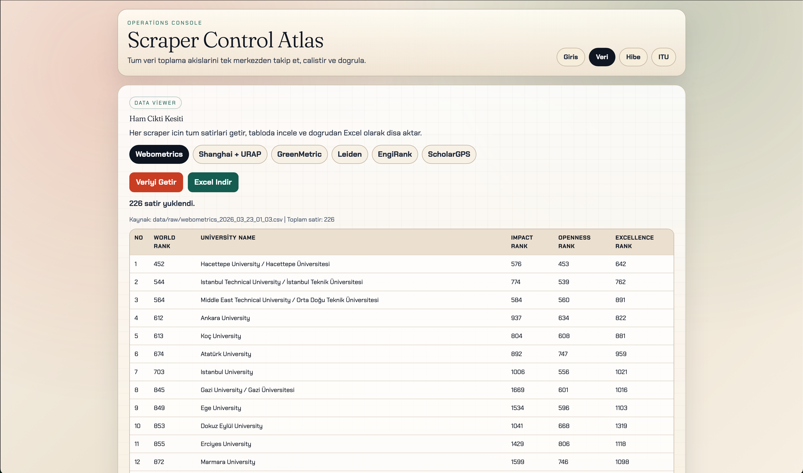

# University Data Scrapers - Unified Control Dashboard

Tek panelden universite odakli veri toplama islerini calistirmak, izlemek ve ciktilari goruntulemek icin hazirlanmis proje.

## Ozellikler

- Ranking scraperlari: Webometrics, Shanghai + URAP, GreenMetric, Leiden, EngiRank, ScholarGPS
- Hibe (grants) kaynaklari scraper akisi
- ITU surdurulebilirlik haber scraperi
- FastAPI + Vue tabanli dashboard
- Job bazli calistirma, pipeline calistirma, veri goruntuleme, Excel indirme
- Uzun suren scraperlar icin canli durum ve log gosterimi

## Proje Yapisi

- `unified_control_dashboard/`: backend, frontend ve scraper orkestrasyon kodu
- `start-dashboard.sh`: tek komutla dashboard baslatma scripti
- `requirements.txt`: root install girisi (`unified_control_dashboard/requirements.txt` dosyasina yonlenir)

## Gereksinimler

- Python 3.9+
- Node.js + npm (frontend build icin)
- Playwright Chromium (browser tabanli scraperlar icin)

## Kurulum

```bash
cd /Users/ali-kemal/Downloads/university-data-scrapers-main

# opsiyonel: venv olustur
python3 -m venv .venv
source .venv/bin/activate

# python paketleri
pip install -r requirements.txt

# playwright browser
playwright install chromium
```

## Calistirma

Varsayilan port (8080):

```bash
cd /Users/ali-kemal/Downloads/university-data-scrapers-main
./start-dashboard.sh
```

Onerilen (8094, temiz baslatma + frontend rebuild):

```bash
cd /Users/ali-kemal/Downloads/university-data-scrapers-main
lsof -ti tcp:8094 | xargs kill -9 2>/dev/null || true
UI_PORT=8094 FORCE_FRONTEND_BUILD=1 ./start-dashboard.sh
```

Acilis adresi:

- `http://127.0.0.1:8080` (varsayilan)
- `http://127.0.0.1:8094` (onerilen komut ile)

## API Ozeti

- `GET /api/jobs`
- `POST /api/run/{job_id}`
- `POST /api/run-async/{job_id}`
- `GET /api/run-status/{run_id}`
- `POST /api/run-pipeline/{pipeline_name}`
- `GET /api/data/{job_id}`
- `GET /api/data/{job_id}/all`
- `GET /api/data/{job_id}/download.xlsx`
- `GET /api/history`
- `GET /api/health`

## Ekran Goruntuleri

### Dashboard Ana Sayfa


### Veri Goruntuleme (Coklu Tablo)



### Canli Islem Durumu


## Troubleshooting

- Port doluysa once sureci kapat:
	- `lsof -ti tcp:8094 | xargs kill -9 2>/dev/null || true`
- Uzun sureli scraper calisirken dashboardda canli log satirlarini takip et.
- ScholarGPS gibi browser tabanli scraperlarda `playwright install chromium` kurulu oldugundan emin ol.

## Notlar

- Run gecmisi: `unified_control_dashboard/data/run_history.json`
- Ana dependency kaynagi: `unified_control_dashboard/requirements.txt`
